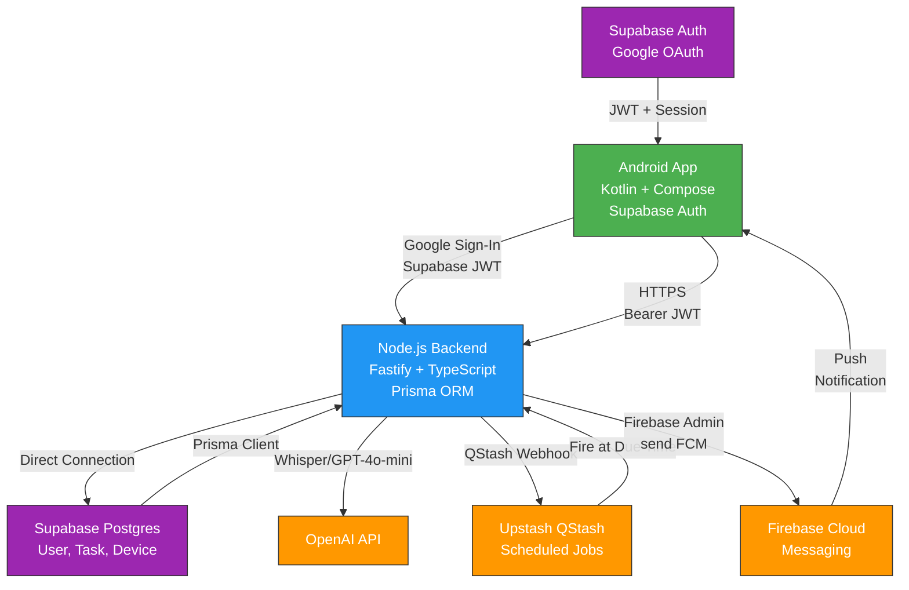

# VoiceTask — Voice-to-Task Mobile App

A modern Android app where users record voice notes that get transcribed by OpenAI Whisper, confirmed by the user, and then processed by gpt-4o-mini to extract task details. Tasks are persisted in a Supabase Postgres database, with push notifications sent via Firebase Cloud Messaging when reminders are due. The app uses Supabase Auth for Google Sign-In and a Node.js backend (Fastify) that handles all business logic.

## Architecture



## Project Structure

```
VoiceTask/
├── backend/                # Node.js + Fastify + Prisma backend
│   ├── src/
│   │   ├── config/         # Env validation, Prisma client
│   │   ├── middleware/     # Auth middleware (Supabase JWT verify)
│   │   ├── routes/         # API endpoints (users, voice, tasks, devices, webhooks)
│   │   ├── services/       # Business logic (OpenAI, FCM, QStash, Supabase JWT)
│   │   ├── schemas/        # Zod request/response schemas
│   │   ├── utils/          # Error handling
│   │   └── server.ts       # Fastify app entry
│   ├── prisma/schema.prisma # Database schema
│   ├── package.json
│   ├── tsconfig.json
│   ├── docker-compose.yml  # Local Postgres
│   ├── .env.example
│   ├── requests.http       # API test collection
│   └── README.md           # Backend setup guide
│
├── android/                # Kotlin + Compose Android app
│   ├── app/
│   │   ├── src/main/
│   │   │   ├── java/com/akash/voicetask/
│   │   │   │   ├── di/           # Hilt modules (Network, Supabase, Database)
│   │   │   │   ├── data/         # Remote (API), Local (Room), Repository
│   │   │   │   ├── ui/           # Screens (Auth, Home, Record, Detail, etc.)
│   │   │   │   ├── audio/        # AudioRecorder
│   │   │   │   ├── notification/ # FCM service
│   │   │   │   ├── navigation/   # Navigation graph
│   │   │   │   └── *.kt          # App entry points
│   │   │   └── res/              # Strings, themes, XML resources
│   │   ├── build.gradle.kts
│   │   └── proguard-rules.pro
│   ├── build.gradle.kts
│   ├── settings.gradle.kts
│   └── README.md           # Android setup guide
│
└── README.md               # This file
```

## Setup Order

Follow these phases in order:

### Phase 1: Backend Foundation ✅
- Fastify, TypeScript, Prisma, Zod
- Health check endpoint
- Local Postgres via Docker Compose
- See [backend/README.md](backend/README.md)

### Phase 2: Backend Auth ✅
- Supabase JWT verification (HS256)
- User JIT provisioning
- POST/PATCH `/users/me`

### Phase 3: Backend Voice + Tasks ✅
- OpenAI Whisper transcription
- GPT-4o-mini task extraction
- Task CRUD endpoints
- Device registration

### Phase 4: Backend Scheduling + Push ✅
- QStash job scheduling
- Firebase Cloud Messaging
- Webhook endpoint with signature verification

### Phase 5: Android Skeleton ✅
- Supabase Auth integration
- Google Sign-In flow
- Navigation setup
- See [android/README.md](android/README.md)

### Phase 6: Android Voice Flow (In Progress)
- Audio recording (MediaRecorder, M4A/AAC)
- RecordScreen, TranscriptScreen, PreviewScreen
- Room database caching
- Task creation flow

### Phase 7: Android FCM + Polish (Pending)
- Firebase Cloud Messaging service
- Task detail screen with deep links
- Sign-out flow
- ProGuard configuration

## Key Features

- **Supabase Auth**: Google Sign-In with JWT-based API authentication
- **Voice-to-Task**: Whisper transcription → GPT-4o-mini extraction → preview + edit → save
- **No Audio Persistence**: Audio streamed in-memory, never written to disk or database
- **Push Notifications**: QStash scheduler → FCM delivery on task due time
- **Offline-First UI**: Room database with optimistic updates
- **Privacy-Focused**: Only confirmed transcripts stored, JWT verification server-side

## Prerequisites

Before starting, ensure you have:

- **Supabase Project**
  - Postgres database
  - Google OAuth provider enabled (Web + Android client IDs configured)
  - JWT secret (for backend verification)
  - Connection string (for local dev or direct connection)

- **Google Cloud Console**
  - Web OAuth 2.0 client ID (for Supabase)
  - Android OAuth 2.0 client (with debug SHA-1 registered for local dev)

- **OpenAI**
  - API key with billing enabled
  - Access to Whisper and gpt-4o-mini models

- **Firebase**
  - Project created
  - `google-services.json` downloaded (for Android)
  - Service account JSON (for backend FCM)

- **Upstash**
  - QStash project
  - API token
  - Current and next signing keys (for webhook verification)

- **Local Development**
  - Docker and Docker Compose (or local Postgres)
  - Node.js 20+
  - Android Studio + SDK (for Android development)
  - Java 17

## Running Locally

### Backend

```bash
cd backend

# Install dependencies
npm install

# Start local Postgres
docker compose up -d

# Copy .env.example to .env and fill in your credentials
cp .env.example .env

# Run Prisma migrations
npx prisma migrate dev --name init

# Start dev server (runs on port 3000)
npm run dev

# Verify health check
curl http://localhost:3000/health
```

### Android

```bash
cd android

# Update BuildConfig fields in app/build.gradle.kts:
# - BACKEND_URL (dev: http://10.0.2.2:3000, prod: https://your-api.com)
# - SUPABASE_URL
# - SUPABASE_ANON_KEY
# - GOOGLE_WEB_CLIENT_ID

# Place google-services.json in app/
cp path/to/google-services.json app/

# Build and run in Android Studio
# or via CLI:
./gradlew installDebug
```

## API Overview

See [backend/requests.http](backend/requests.http) for detailed request/response examples.

### Auth
- `POST /users/me` — JIT user creation/update
- `PATCH /users/me` — Update user profile

### Voice
- `POST /voice/transcribe` — Transcribe audio to text (Whisper)
- `POST /voice/extract` — Extract task from text (gpt-4o-mini)

### Tasks
- `GET /tasks?status=pending` — List user's tasks
- `GET /tasks/:id` — Get single task
- `POST /tasks` — Create task
- `PATCH /tasks/:id` — Update task
- `DELETE /tasks/:id` — Delete task

### Devices
- `POST /devices` — Register FCM token
- `DELETE /devices/:fcmToken` — Unregister device

### Webhooks
- `POST /webhooks/qstash` — QStash reminder callback (sends FCM)

### Health
- `GET /health` — Server status

## Critical Privacy Notes

- **Audio is never persisted**: Streamed in-memory through OpenAI, discarded after transcription
- **No audio logging**: Not logged, not written to disk, not stored in database
- **Confirmed transcripts only**: Only user-approved transcript text is stored in `Task.transcript`
- **Backend validation**: All requests except health/webhooks require valid Supabase JWT

## Deployment

### Backend (Fly.io example)

```bash
cd backend

# Install Fly CLI and authenticate
brew install flyctl
flyctl auth login

# Create app (one-time)
flyctl launch

# Set secrets
flyctl secrets set DATABASE_URL=postgresql://...
flyctl secrets set SUPABASE_JWT_SECRET=...
flyctl secrets set OPENAI_API_KEY=...
# ... etc

# Deploy
flyctl deploy
```

### Android

Build release APK:
```bash
./gradlew bundleRelease  # For Play Store
./gradlew assembleRelease  # For direct APK
```

Sign with your keystore and upload to Play Store.

## Development Notes

- Backend uses `ts-node` for dev, builds to `dist/` for production
- Android uses Hilt for DI, Compose for UI, Room for local caching
- All timestamps stored in UTC
- Supabase JWT secret is HS256 (symmetric) — treat as highly sensitive
- QStash requires backend to be publicly reachable for webhooks (use ngrok in dev)

## Troubleshooting

### Auth not working
- Verify Supabase Google provider is enabled with correct client IDs
- Check that Android SHA-1 is registered in Supabase
- Ensure `SUPABASE_JWT_SECRET` matches your project's JWT secret (not the anon key)

### OpenAI calls failing
- Verify API key has credits and isn't rate-limited
- Check model names: `whisper-1`, `gpt-4o-mini`

### Push notifications not arriving
- Verify Firebase service account is valid and correct
- Check that device token is properly registered via `POST /devices`
- Use ngrok to test QStash webhooks locally

### Audio upload failing
- Max file size is 10 MB
- Verify `@fastify/multipart` is configured with `buffer` mode (not disk)
- Check device storage permissions (`RECORD_AUDIO` + `POST_NOTIFICATIONS`)

## License

MIT

## Contact

For questions or issues, refer to individual README files in `backend/` and `android/` directories.
